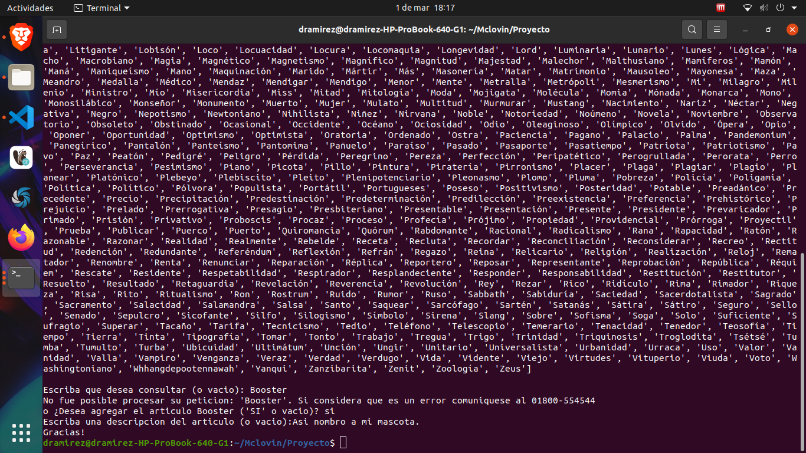
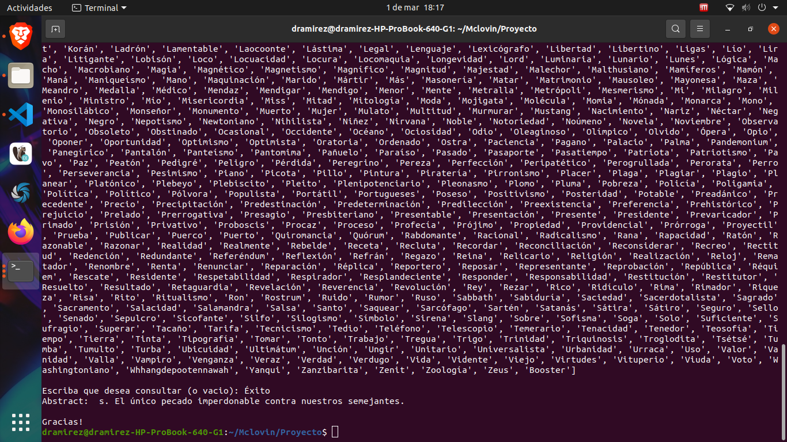
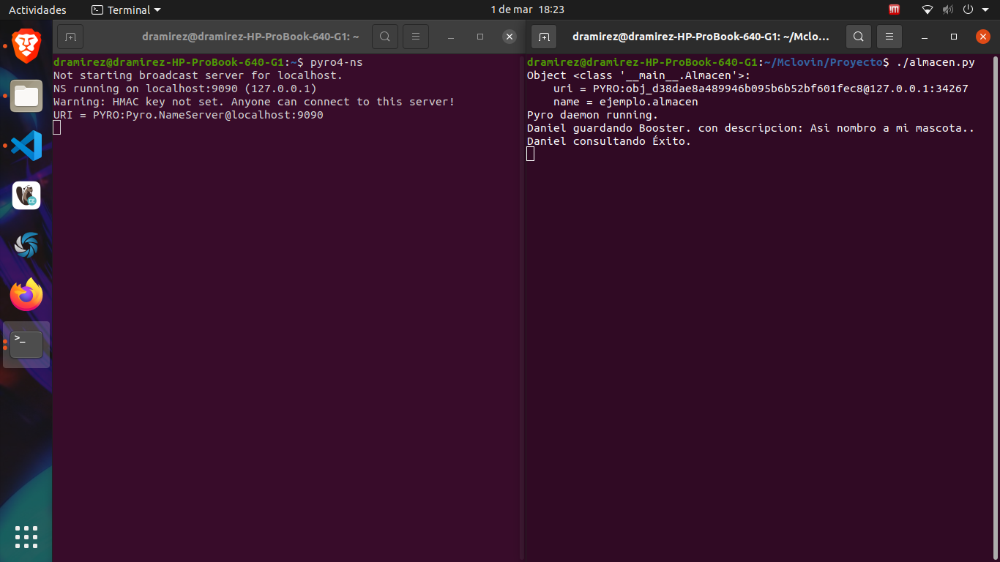

# Aplicacion cliente- servidor

> Crea una Aplicación cliente-servidor utilizando llamadas a metodos remotos (Pyro) utilizando python.

El servidor debera estar siempre disponible y permitira conexiones de multiples clientes. EL cliente envia una petición con una palabra cuyo significado sera devuelto por el programa servidor. En caso de que el servidor no encuentre la palabra, permitira la opcion de que esta palabra y su significado sea agregado al diccionario.

El archivo [diccionario.txt](diccionario.txt) sera el diccionario a utilizar en la aplicación. 

### Resultado: 

 
### ./consulta.py

